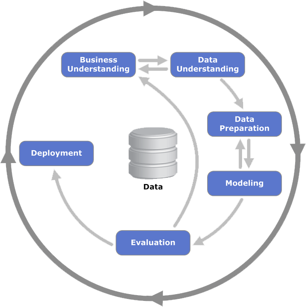
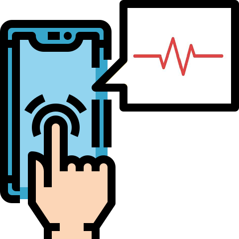

# UC_Berkeley_MLAI_Capstone_Project
This is my Capstone Project for the Professional Certificate in Machine Learning and Artificial Intelligence from UC Berkeley (UC Berkeley, 2022).

The machine learning classification project was developed using the Cross Industry Standard Process for Data Mining (CRISP-DM) method (Schröer, et al, 2021) of data analysis, see Figure 1 below.
 

Figure 1: The Cross Industry Standard Process for Data Mining (CRISP-DM)

## Location of Jupyter Notebook:
The corresponding Jupyter Notebook used to analyze the dataset is located in Github at the following location:

https://github.com/andrespineda/UC_Berlekey_MLAI_Capstone_Project

## **Capstone Research Question**

Can commonly available wearable devices be used to accurately self-monitor stress levels?

## **Business Understanding**

**Background**

Research shows that stress is a major issue for young adults. A 2022 survey found that 66% of young adults aged 18 to 24 reported stress-related symptoms, compared to 25% of those aged 65 and older. Stress is also linked to many health issues, including heart disease, cancer, lung ailments, accidents, cirrhosis of the liver, and suicide (Statista, 2023).

Some indications of the ill effects of stress can be visually identified without special equipment, but sustained long term stress may cause internal issues that are not easily detected. The common method of measuring underlying stress conditions requires a trip to a medical facility where expensive medical equipment is used by trained clinicians.

If there was a way that a person could accurately and inexpensively measure their stress levels without going to a clinic, they could use that information as feedback so that they could learn to monitor and control their stress levels on their own.

**Business Objective**

The business objective of this project is to develop a machine learning classification model that is capable of determining whether a file of heart rate samples can be classified as being under stress or not. Heart Rate Variability (HRV) is a measurement of the variation in time between each heartbeat. By training a classification model on HRV data, we can determine whether someone is in a stressed condition or not. We will be using data labeled as stress and no stress to train the model. This process will train the classification model to recognize patterns that can be used to differentiate the two conditions. Once trained, the model will be able to classify new input files of HRV data with high accuracy, allowing us to better understand the relationship between HRV and stress.

**Why is this important?**

The use of an inexpensive wearable device to capture, classify, and present a visual indicator of a person's stress level can help reduce a serious problem faced by young adults. This tool would allow a person to self-monitor and control their stress levels without the need for expensive clinical equipment or visits to a medical facility.

**Business Expected Results**

It is expected that a classification model can be developed that can accurately classify stress level categories using a sampling of HRV data. Ideally, a short sampling period of one to three minutes will be sufficient for the model to classify the stress level during the sampling period.

It is expected that a widely available wearable device, such as a wrist or arm-band heart rate monitor, an Apple watch, or even a smartphone with a camera could be used to capture the HRV data. The captured data can be used by the trained classification model to assess the stress level of the person immediately after the data was captured. The results of the classification model need to be presented to the user via a easy to i-understand visual stress indicator on their smartphone. For example, a circular gauge that goes from blue for low stress to red to indicate high stress.

**Business Success Criteria**

The success criteria will be based on meeting the following measurable results:

1. We will develop a classification model that can take as input a one-to-three-minute recording of a person's heart rate.
2. Based on this sampling of the person’s heart rate, the classification model will classify the readings into stressful and non-stressful periods of time according to the following metrics:

* A Recall score (Sensitivity or True Positive rate) of 85%. It is important for the model to correctly identify True Positives. Being able to correctly identify stress from the reading is important so the person can take corrective action. In this problem, a high recall value is preferable than a high accuracy score.

3. The classification model will be able to classify the data within 15 seconds. The model will eventually operate within a smartphone and it wil be important for the user to be able to get a stress reading with a short time after taking a heart rate sample.

## **Data Sources**

In 2014, a study was conducted to measure the heart rate of a group under normal and stressful conditions. The data was collected by researchers at the Institute for Computing and Information Sciences at Radboud University (Koldijk, S., et.al.,2014). The dataset, referred to as SWELL, consists of heart rate signal recordings of 25 subjects doing typical office work, including writing reports, making presentations, reading e-mail and searching for information. The scientists recorded the signals during typical working stressors such as receiving unexpected emails interruptions and pressure to complete their work on time.  The SWELL dataset has been made available for stress related research.

One of the key signals that can be used to identify stress levels is the variability of the timing between heartbeats. The root mean squared standard deviation (rMSSD) between the R-R peaks is also referred to as Heart Rate Variability (HRV.)

A copy of the SWELL dataset is available from several sources, including Kaggle:** **https://www.kaggle.com/datasets/qiriro/swell-heart-rate-variability-hrv

## **Project Plan**

**Techniques Used**

The SWELL dataset contains labeled samplings of the heart rate over time during non-stress and stressful conditions. Although the data is in time series format, the objective is to identify the timing differences between the heartbeat intervals. The time series data will require de-trending and stationarity techniques will be used to isolate the recurring heartbeat pattern. The peak-to-peak intervals can then be extracted to form the basis for the analysis.

For classification modeling, the most recent techniques will be evaluated.

These initial models include:

1. **Logistic Regression**
2. **K Nearest Neighbor**
3. **Support Vector Model**
4. There may be additional classification methods later in the course that could also be used to develop an accurate classification model.

**Scope of Work**

**Phase 1 - In Scope**

The initial scope of work involves utilizing the SWELL stress dataset to train various classification models. Initially, the model would operate from a laptop with the captured HRV data input via an external file upload. This would be enough to validate the concept. Ultimately, the HRV heart rate gathering logic and the trained classification model would be coded as a smartphone app that could be downloaded from the Apple store or Google Play store by the average consumer.

Each model will undergo evaluation to determine the best fit for our primary objective: accuracy in predicting stress and processing speed. Additionally, we will explore alternative classification techniques introduced in upcoming lessons and incorporate them into the testing and evaluation process until the optimal model is selected.

**Phase 2 - In Scope**

During Phase 2, the trained model will classify HRV (heart rate variability) data captured from an external wearable device. 
Specifically, we will use data collected via a Polar H10 chest strap, commonly used by athletes to monitor heart rates during exercise. The data will undergo processing to extract rMSSD (root mean square of successive differences) inter-interval readings. These labeled data points will then be used to test and validate the classification model's accuracy.

**Phase 3 - In Scope**

In Phase 3, well extend the trained model to classify HRV data obtained from smartphones. This data will consist of PPG (photoplethysmography) videos, which require processing to extract heartbeats.

 We will apply detrending and stationarity logic to obtain the rMSSD inter-interval readings. Like Phase 2, the labeled data will be used for testing and validating the classification model’s accuracy.

**Phase 4 - Aspirational Goal (Out of Scope)**

In the final deployment phase, we aim to combine the updated classification model with PPG heart rate reading logic into a single codebase. This codebase can run within a smartphone app, accessible via a graphical user interface. Users will be able to start and stop reading, and the app will display an intuitive "stress indicator" graphic based on the inferred stress levels from the PPG data.

## **Data Preparation**

**Select Data** - Inclusion/Exclusion

**Clean Data**

Check for missing values

Balanced data

Categorization

Correlation Matrix

## **Modeling**

Select Modeling Techniques

Training Data Split

Standardization

Build Model

GridScoreCV

Assess Model

- Confusion Matrix
- Recall, Accuracy and F1 Score
- Receiver Operating Characteristic Curve (ROC Curve)
- Precision-Recall Curve (PRC)
- PRC Interpretation

Conclusion

## **Evaluation**

Evaluate Results

Data mining vs business success Criteria

Approved Models

Next Steps

List of passible Actions

Decision

